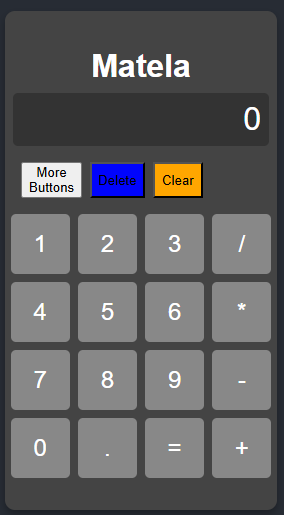

# Matela Calculator
https://matela-cyber.github.io/calculator/

SharpSonof Calculator is a powerful and flexible web-based calculator application. It supports basic arithmetic operations, parenthesis handling, implicit multiplication, and advanced functionality such as converting decimal numbers to fractions. The project is built using **HTML**, **CSS**, and **JavaScript**.

---

## Features

1. **Basic Arithmetic Operations**
   - Addition, subtraction, multiplication, and division.

2. **Advanced Calculations**
   - Handles parenthesis.
   - Simplifies consecutive operators (e.g., `--` becomes `+`).
   - Implicit multiplication handling (e.g., `2(3+4)` becomes `2*(3+4)`).

3. **Input Handling**
   - Supports decimal numbers.
   - Converts decimals to fractions for accurate calculations.

4. **Error Handling**
   - Division by zero is gracefully handled with appropriate error messages.
   - Detects mismatched parentheses and alerts the user.

5. **User-Friendly Interface**
   - Clear display area to show inputs and results.
   - Buttons for number input, operations, and special functions like clear and delete.

6. **Dynamic Button Modes**
   - Toggle between different button layouts for extended functionality.

---

## Tech Stack

- **Frontend**: HTML, CSS, JavaScript
- **Styling**: CSS for a clean, responsive interface.

---

## How to Run

   git clone or open file index.html with web browser
